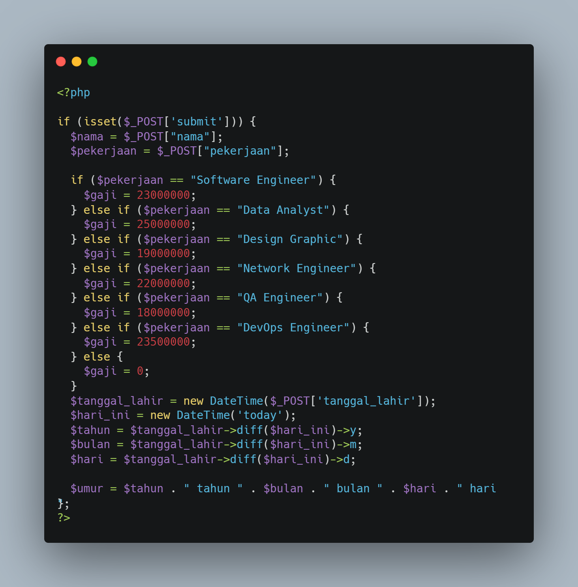
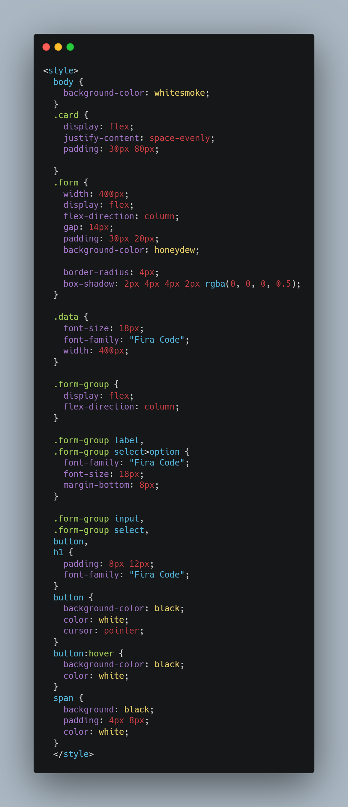
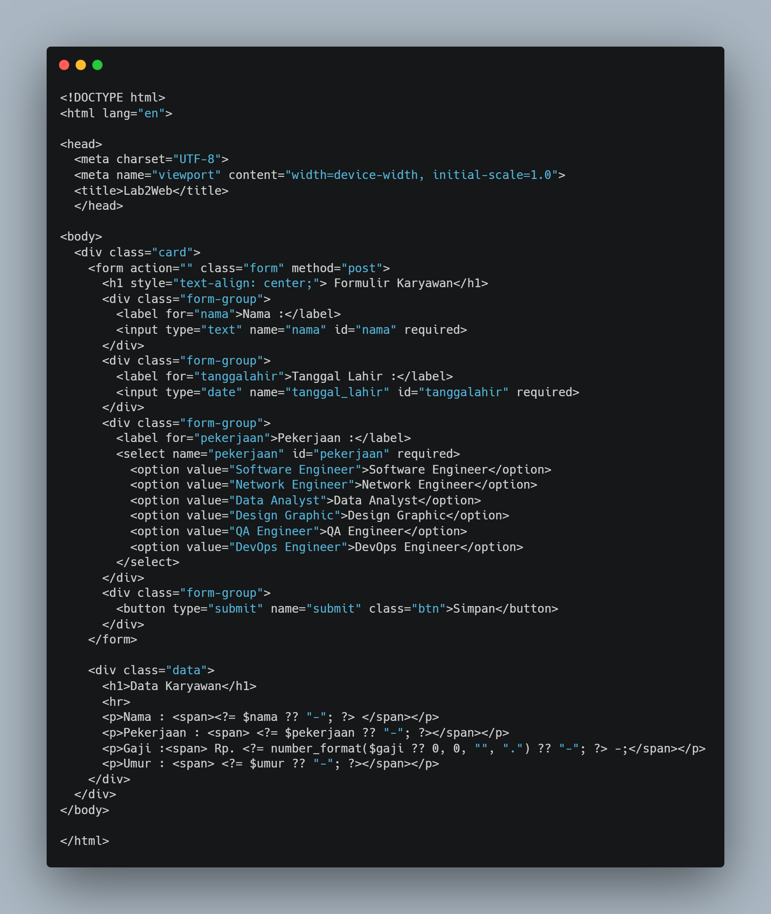

# tugas1 

untuk membuat code sederhana menggunakan php pertama buat file di xampp yang ada di system, setelah itu berikut beberapa code nya

* code php sederhana
  

 

* code css sederhana untuk membuat tampilan website lebih menarik
  

 

* untuk membuat code html sebagai berikut
  

 

* dan berikut hasil dari code di atas
  

# terimakasih
